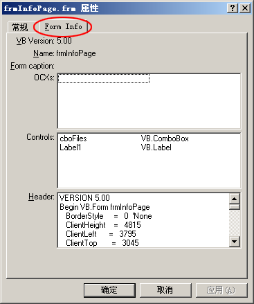



## Property Sheet Sample Plus

### Description

Add your own property page to any file type you want!

Caution:from Edanmo's Shell Extensions - Property Sheet Handler(http://www.mvps.org/emorcillo/cod/shell.htm) & Property Sheet Handling (shell extensions) in windows - excellent example of api , registry handling(http://www.planet-source-code.com/vb/scripts/ShowCode.asp?txtCodeId=50229&lngWId=1)

do not vote for me.

use shell ext lib & OLE lib: http://www.mvps.org/emorcillo/cod/shell.htm

Fully handy library to make your own property page for any file type you disire.

Note: I just add a class and fixed some lines of code.

Usage: check "sub main" in mdlGlobalData.bas

again, please do not vote for me.
 
### More Info
 

             |
---                |---
**Submitted On**   |2003-12-01 21:06:26
**By**             |[CodeClub](https://github.com/Planet-Source-Code/PSCIndex/blob/master/ByAuthor/codeclub.md)
**Level**          |Advanced
**User Rating**    |5.0 (10 globes from 2 users)
**Compatibility**  |VB 5\.0, VB 6\.0
**Category**       |[OLE/ COM/ DCOM/ Active\-X](https://github.com/Planet-Source-Code/PSCIndex/blob/master/ByCategory/ole-com-dcom-active-x__1-29.md)
**World**          |[Visual Basic](https://github.com/Planet-Source-Code/PSCIndex/blob/master/ByWorld/visual-basic.md)
**Archive File**   |[Property\_S1678561212003\.zip](https://github.com/Planet-Source-Code/codeclub-property-sheet-sample-plus__1-50237/archive/master.zip)

